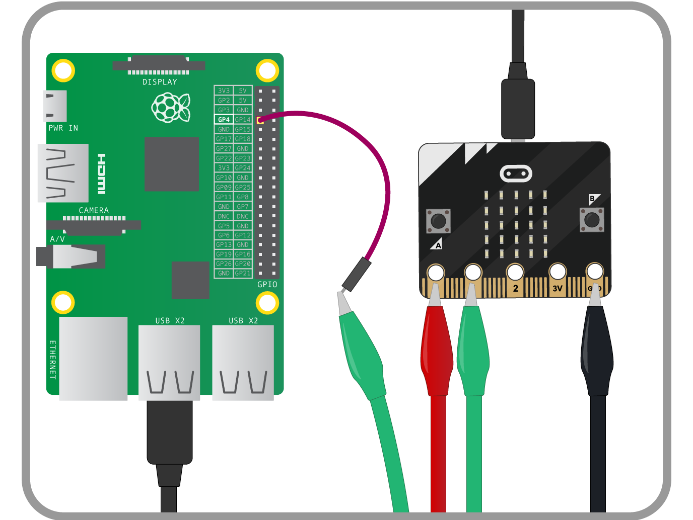
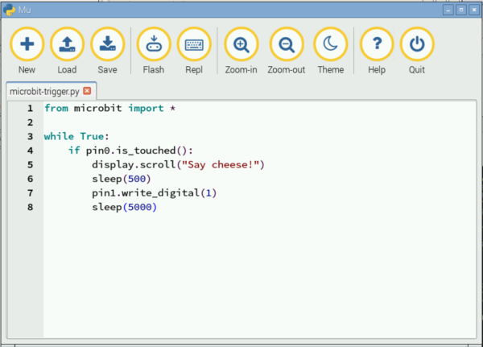
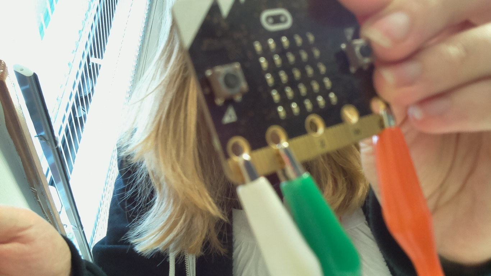

# BBC micro:bit selfies

In this resource you will make a BBC micro:bit controlled selfie booth with a Raspberry Pi and camera module using Python. This is a great way to get started with hardware and simple text programming.

## Connect the camera & micro:bit

1. Ensure that you have read [Getting Started with BBC Microbit](raspberrypi.org/learning/getting-started-with-microbits) resource and have followed step 1 to install the software [Mu](software.md) which we will be using to program this project. 
1. Then connect your BBC micro:bit to your Raspberry Pi following step 2. 
1. You will also need to have connected your Raspberry Pi camera module to your Raspberry Pi. [Getting started with Raspberry Pi Camera]() contains instructions on how to do this in step 1 and 2.


## Build the micro:bit trigger

1. Connect a male-to-female jumper wire to GPIO pin `4` on your Raspberry Pi. 
1. Take a crocodile clip cable and connect one end to the pad on your micro:bit labelled `0` nd another to the pin labelled `GND` or ground.
1. Connect another cable to pin `1` and connect the other end to the male end of the jumper wire you used on your Raspberry Pi, like in the diagram below:

	

	Now that you have created your trigger circuit, you can boot your Raspberry Pi and load Mu. 

## Program the micro:bit trigger

1. Open Mu and click on **New** to open a blank untitled file. 
1. Click on **Save** and name the file `microbit-trigger.py' and press enter on your keyboard.
1. The first line in your file should already be typed out for you and reads:
	
	```python
	from microbit import *
	```
   This line imports the microbit python library module for you to use. 
   
1. Next create a loop by typing:

	```python
	while True:
	```
	
	*Note: Uppercase and lowercase letters are very important when typing Python code. Notice that `True` has an uppercase `T` and a colon at the end. everything written after this line should be indented by four spaces.* 	   

1. Now we need to set a condition so that when the cable connected to Pin 0 on the micro:bit has been touched it displays a message on the LED matrix and triggers the camera. We do this in python using the word `if` like this:

	```python
	while True:
	    if pin0.is_touched():
	        display.scroll('say cheese!")
	        sleep(500)
	        in1.write_digital(1)
        sleep(5000)
	```
	Each time around this loop, the computer asks if the cable attached to Pin 0 is being touched. If it is, then the message 'say cheese!' should appear and tell pin 1 to become high or turn on. This is the pin that is connected to the Raspberry Pi. We will use that pin in the next step to trigger the camera to take a picture and store it. 

	
	
1. Save the file and then click on **Flash** to send the code to your microbit. It is important that you do this step to test that your trigger works. Once the amber light on the back of the micro:bit stops flashing, press the reset button next to it and then touch the ground and pin 0 crocodile clip cables. This should trigger text to scroll across the led matrix on the micro:bit. 
	
## Program the Raspberry Pi camera

1. Locate and open Python 3 (IDLE) from the main menu by clicking on programming. This is where you will write your python code for the camera.
1. Save the file as `microbit-camera.py`.
1. Begin by importing all the libraries and modules required in this program by typing:

	```python
	from picamera impirt PiCamera
	from gpiozero import Button
	from time import sleep
	```
	
1. Next, you need to tell the computer which pin is going to be used to trigger the camera to take a picture. You connected the microbit to GPIO pin 4. Underneath type:

	```python
	button = Button(4, pull_up = False)
	```

1. Then write the sequence of instructions to take a picture when triggered by someone touching the micro:bit cable. First a preview from the camera can show by typing:

	```python
	with PiCamera() as camera:
	    camera.start_preview()
	    sleep(1)
	```

    Whilst the preview shows you can get into prosotion for your selfie. 
    
1. Underneath type the instruction to wait for the micro:bit trigger:

	```python
	    button.wait_for_press()
	    camera.capture('selfie.jpg`)
	    camera.stop_preview()
	```
	
	The program will wait for the trigger from the micro:bit, then take a picture and store it in a file called `selfie.jpg` before stopping the camera preview. 
	
	

1. Save your file. Check that your micro:bit trigger is working, before clicking on **Run** and **Run Module** to start the camera code. 

	

## Whats next?
1. Can you create a count down on the micro:bit LED matrix before a photo is taken by the camera?
1. Now that you have the camera taking one picture triggered by the micro:bit, how could you take more pictures and save them as separate files?
1. Take a look at the [Getting Started with BBC Microbit](raspberrypi.org/learning/getting-started-with-microbits) resource for more ideas of what you could do with your BBC micro:bit. 
    	    	
